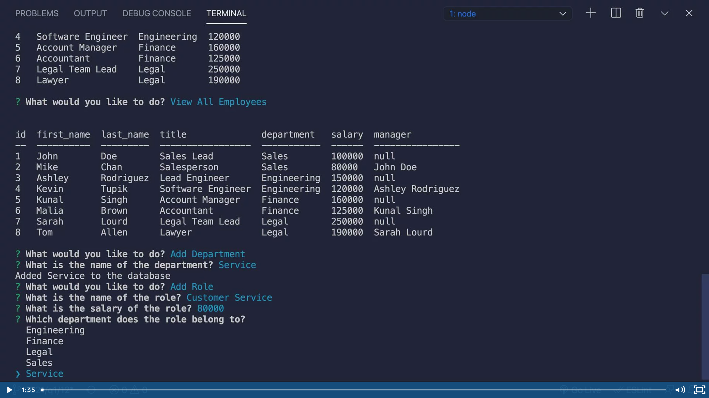

# embed-wistia-demo

We currently can't directly embed a video unless the video is directly uploaded to GitHub.

As a work around, we use a screenshot with a link.  When the image is clicked on, it leads to the video.

